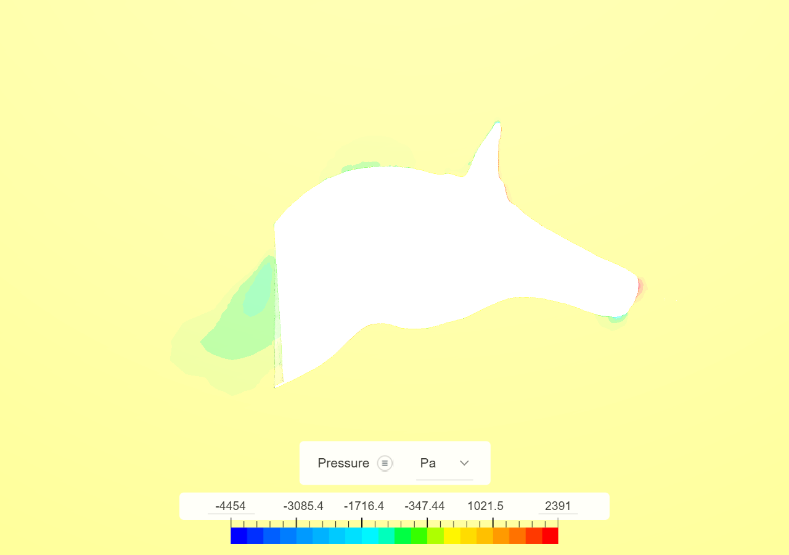
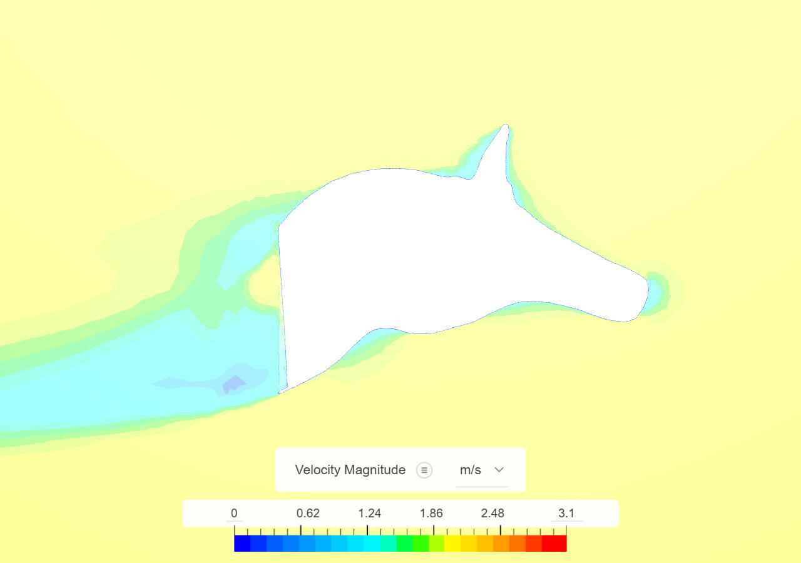

# Spinosaurus mirabilis — crest hydrodynamics findings

Steady RANS CFD screening of the scimitar-crested *Spinosaurus mirabilis* head,
run in SimScale. The central question: does the crest impose enough hydrodynamic
penalty to make diving impractical?

## CFD setup

| Parameter | Value |
|-----------|-------|
| Fluid | Water, incompressible |
| Turbulence | k-omega SST |
| Inlet | Uy = +2 m/s at minimum-Y face |
| Outlet | Zero-gauge pressure at maximum-Y face |
| Walls | Slip walls |
| Iterations | 1,000 |
| Mesh | ~1.6M cells, ~618K nodes |
| Geometry | Nobilis 2 artist mesh, voxel-solidified, SimScale Fit-to-Surface Wrap at resolution 8 |

> A matched crest-reduced control run is needed to isolate the crest's drag
> contribution. The current result is a numerical checkpoint, not a comparative
> biological result.

## Key findings

### Convergence

| Metric | Final residual |
|--------|---------------|
| Ux | 1.6e-5 |
| Uy | 9.3e-7 |
| Uz | 1.6e-5 |
| k | 9.9e-5 |
| omega | 3.7e-7 |
| p | 1.9e-4 |

### Force & moment stability (final 200 samples)

| Quantity | Mean | Std |
|----------|------|-----|
| Total Y-force | 287.6 N | 0.18 N |
| Total moment X | -25.9 N·m | 0.46 N·m |

The small standard deviations over the final 200 samples indicate the solution
has converged and is repeatable.

## Results images

### Pressure field

### Velocity magnitude

## Interpretation

The converged CFD solution shows substantial hydrodynamic loading on the
*S. mirabilis* head geometry. The large total Y-force (287.6 N) and negative
moment about X (-25.9 N·m) indicate that the crest geometry creates significant
pressure drag and a nose-down pitching moment during forward motion.

These forces are consistent with the crest imposing meaningful hydrodynamic
constraints that would have made sustained submerged locomotion — especially
diving — impractical for an animal of this size and crest morphology.

## Raw data

All solver telemetry is available in `results/simscale/mirabilis_crest_present_U2mps/raw/`:

- `residuals.csv` — solver residual history
- `forces.csv` — pressure, viscous, and total forces
- `moments.csv` — pressure, viscous, and total moments

Compiled stability statistics: `results/simscale/mirabilis_crest_present_U2mps/summary.csv`

## Third-party geometry attribution

> "Spinosaurus mirabilis" (https://skfb.ly/pKMVN) by Nobilis 2 is licensed
> under [Creative Commons Attribution 4.0]
> (http://creativecommons.org/licenses/by/4.0/).

The original `.blend` is preserved at `geometry/source/` as an immutable
source asset. All derived surfaces document their origin from this mesh and
are not represented as newly recovered anatomy.