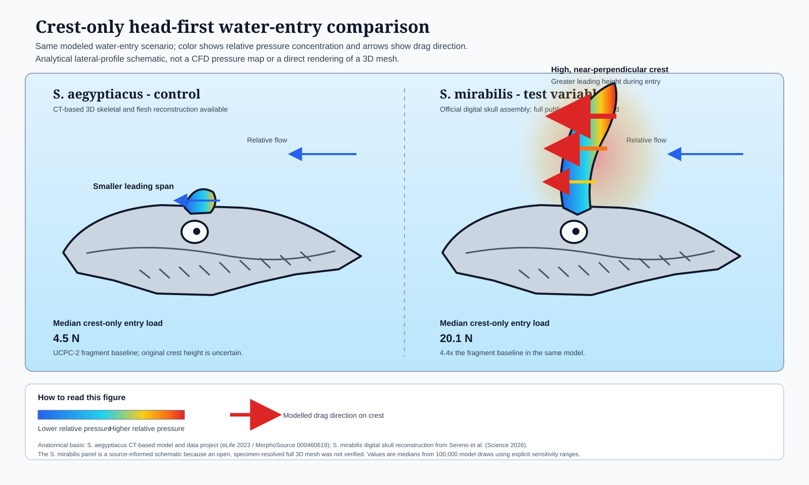

# Spinosaurus mirabilis scaling

This repository contains a small, source-backed analysis prototype for studying `Spinosaurus mirabilis` with a combined lens:

- quantitative morphology
- density context from the better-documented `S. aegyptiacus` literature
- qualitative ecological context

The goal is not to predict geology. It is to use measurements and contextual evidence together to make a species-level generalization about what makes `S. mirabilis` distinctive.

## Working idea

The current hypothesis is that `S. mirabilis` is best interpreted as:

- a crest-dominant spinosaur
- with an inland-riparian ecological setting
- whose novelty is strongest in display morphology and habitat differentiation
- rather than in any claim that density alone proves a new aquatic mode

## What is included

- `data_ingestion.py`  
  Loads a bone measurement table, identifies specimen IDs, separates independent proxies from dependent variables, and emits telemetry for regression-ready data.

- `mirabilis_analysis.py`  
  Summarizes public claims about `S. mirabilis` and the UChicago Fossil Lab into a compact quantitative report.

- `mirabilis_habitat_analysis.py`  
  Compares public habitat evidence for `S. mirabilis` and `S. aegyptiacus` to show the ecological contrast used in the synthesis.

- `mirabilis_integrated_analysis.py`  
  Combines crest/body-size data, density context, and habitat evidence into one integrated generalization.

- `mirabilis_evidence.csv`  
  Source-backed evidence rows used by the general analysis script.

- `mirabilis_habitat_evidence.csv`  
  Source-backed habitat evidence rows used by the ecological comparison script.

- `mirabilis_density_context.csv`  
  Density and compactness context from the `S. aegyptiacus` literature used to avoid overreading a single density proxy.

- `crest_hydrodynamics.py`
  Runs a crest-only head-entry and off-axis hydrodynamic sensitivity analysis for `S. mirabilis` and the `S. aegyptiacus` fragment baseline.

- `crest_hydrodynamics_inputs.csv`
  Records source-informed dimensions and clearly labeled geometric or hydrodynamic assumptions.

- `build_crest_pressure_figure.py` and `crest_pressure_comparison.svg`
  Generate and render the source-labeled side-by-side comparative pressure schematic.

## Main finding so far

The integrated analysis currently points to a simple generalization:

- `S. mirabilis` has a tall crest relative to its estimated body length.
- Its habitat evidence is strongly inland-riparian.
- Density work on `S. aegyptiacus` shows why compactness alone should not be overinterpreted.
- Put together, the clearest signal is display specialization in a riverine setting, not a body-plan revolution.

## Crest Hydrodynamics



The crest model compares the two species side by side:

- `S. aegyptiacus` is the control, anchored to a CT-based 3D skeletal and flesh reconstruction.
- `S. mirabilis` is the test variable, based on the official digital skull assembly described with the 2026 species paper.
- The figure maps relative modeled pressure concentration from blue to red and shows crest drag direction during a head-first water-entry scenario.

The current 100,000-draw sensitivity run estimates a median crest-only entry load of `4.5 N` for the incomplete `S. aegyptiacus` UCPC-2 baseline and `20.1 N` for `S. mirabilis` (`4.4x`). This is an analytical projected-area model, not CFD. It supports a testable loading difference, not a claim that crest drag alone proves diving was impossible.

The `S. mirabilis` panel is a source-informed analytical schematic because an open, specimen-resolved full 3D mesh was not verified.

## Evidence base

Primary public sources used in the current analysis:

- [UChicago News on `S. mirabilis`](https://news.uchicago.edu/story/hell-heron-dinosaur-discovered-central-sahara)
- [PubMed record for the `Science` paper](https://pubmed.ncbi.nlm.nih.gov/41712711/)
- [UChicago/BSD news coverage](https://biologicalsciences.uchicago.edu/news/new-scimitar-crested-spinosaurus-species-discovered-central-sahara)
- [eLife `S. aegyptiacus` reanalysis](https://elifesciences.org/articles/80092)
- [MorphoSource `S. aegyptiacus` 3D data project](https://www.morphosource.org/projects/000460619)
- [Official `S. mirabilis` digital-reconstruction release](https://www.newswise.com/articles/new-scimitar-crested-spinosaurus-species-discovered-in-the-central-sahara)
- [PLOS One paleoenvironments paper](https://journals.plos.org/plosone/article?id=10.1371%2Fjournal.pone.0147031)

## Requirements

- Python 3
- `pandas`
- `numpy`

## Run

```bash
python mirabilis_analysis.py
python mirabilis_habitat_analysis.py
python mirabilis_integrated_analysis.py
python crest_hydrodynamics.py --output-csv crest_hydrodynamics_summary.csv --output-markdown crest_hydrodynamics_report.md
python build_crest_pressure_figure.py
```

To write a markdown report:

```bash
python mirabilis_habitat_analysis.py --output-markdown report.md
python mirabilis_integrated_analysis.py --output-markdown report.md
```

## Notes

This is an early prototype. The current value is in framing a testable hypothesis and organizing public evidence into something reproducible.
