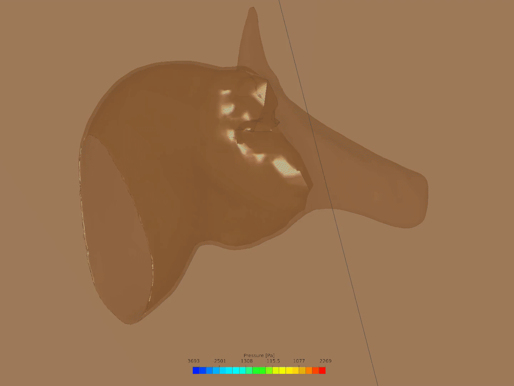

# Spinosaurus mirabilis — crest hydrodynamics findings

Steady RANS CFD screening of the scimitar-crested *Spinosaurus mirabilis* head,
run in SimScale. This is a hobbyist screening study — not a validated engineering
analysis — of whether the crest produces significant hydrodynamic loading.

## CFD setup

| Parameter | Value |
|-----------|-------|
| Fluid | Water, incompressible |
| Turbulence | k-omega SST |
| Inlet | Uy = +2 m/s at minimum-Y face |
| Outlet | Zero-gauge pressure at maximum-Y face |
| Walls | Slip walls (no viscous boundary layer — pressure/form drag only) |
| Iterations | 1,000 |
| Mesh | ~1.6M cells, ~618K nodes, no grid-independence check |
| Geometry | Nobilis 2 artist mesh, voxel-solidified, SimScale Fit-to-Surface Wrap at resolution 8 |
| Cases | One Reynolds number, single run |

## Raw data

All solver telemetry is in `results/simscale/mirabilis_crest_present_U2mps/raw/`:

| File | Contents |
|------|----------|
| `residuals.csv` | Global residual history (Ux, Uy, Uz, k, omega, p) across 1,000 iterations |
| `Domain.csv` | Domain-averaged Ux, Uy, Uz, p convergence |
| `Inlets.csv` | Inlet boundary Ux, Uy, Uz, p convergence |
| `Outlets.csv` | Outlet boundary Ux, Uy, Uz, p convergence |
| `Walls.csv` | Wall boundary Ux, Uy, Uz, p convergence |

## Results images

### Flow animation

## Key observations

- The animation shows the crest region remaining at low pressure (blue) throughout the flow — no high-pressure buildup on the crest itself. This is a qualitative visual observation from one run, not a validated result.
- Final residuals at iteration 1000: Ux = 1.46e-4, Uy = 6.17e-6, Uz = 2.27e-4, k = 4.18e-5, omega = 1.87e-6, **p = 3.06e-3**. The pressure residual is about 16× higher than velocity residuals and is plateaued (not still dropping), so the pressure field is less converged than the velocity field.
- **Slip walls on the body surface** mean this run captures pressure/form effects only — it says nothing about skin-friction drag, which matters for a crest-drag question.
- A crest-reduced control run is needed to isolate the crest's specific drag contribution from the rest of the head geometry.

## Attribution

CFD geometry derived from "Spinosaurus mirabilis" (https://skfb.ly/pKMVN) by Nobilis 2, licensed under [Creative Commons Attribution 4.0](http://creativecommons.org/licenses/by/4.0/).

